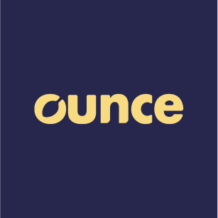
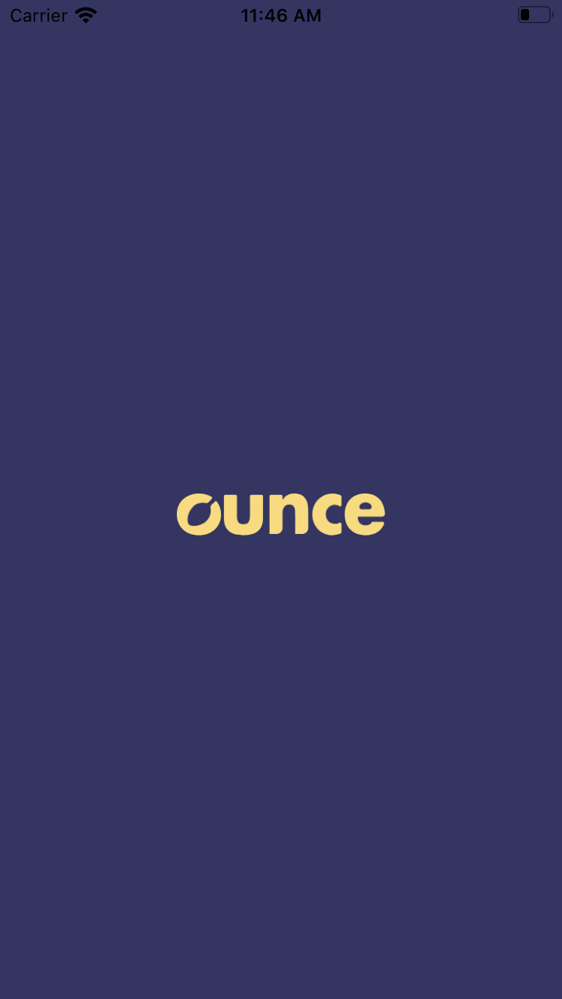
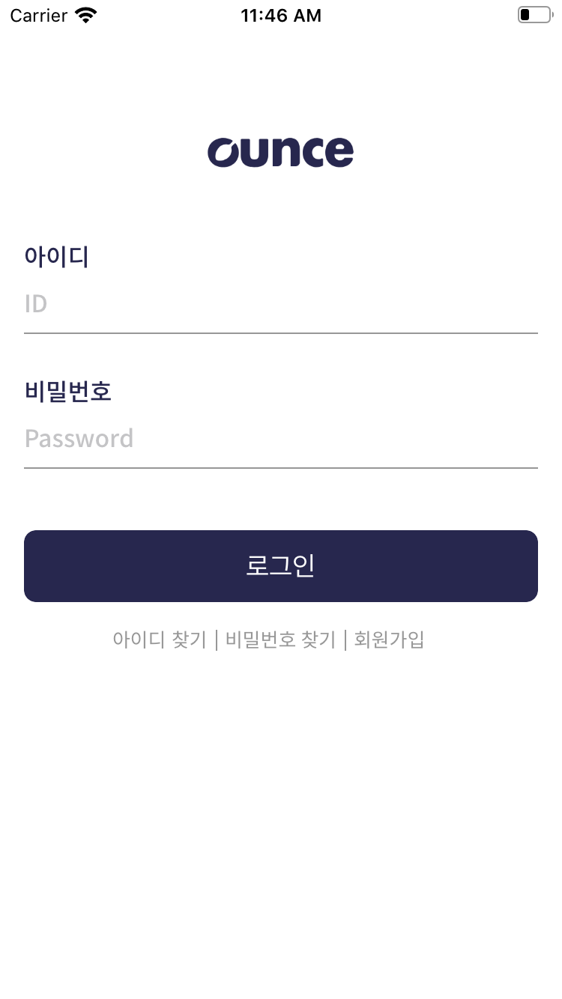
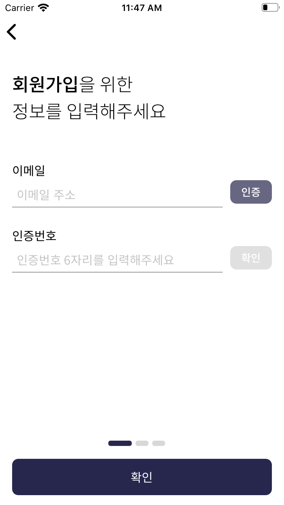
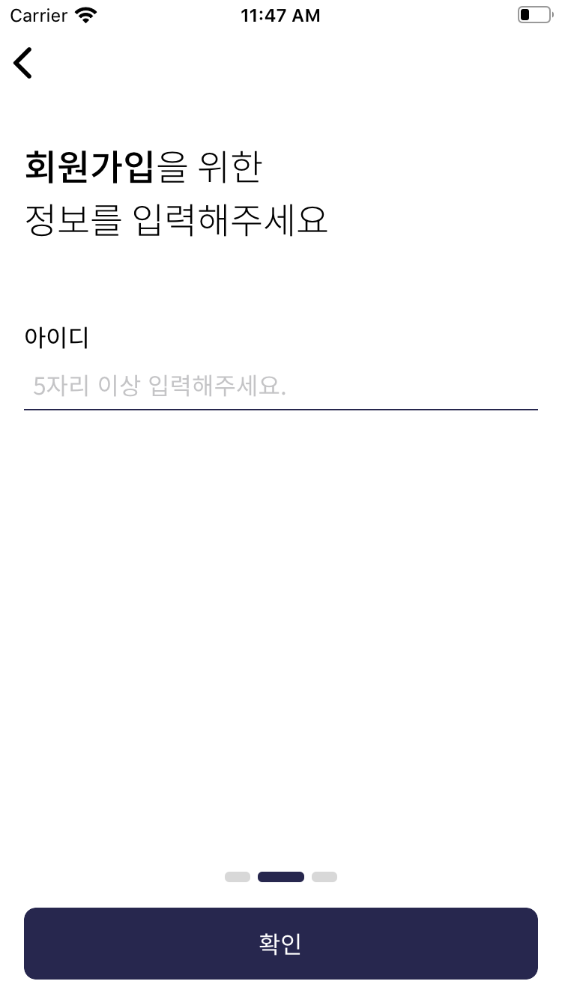
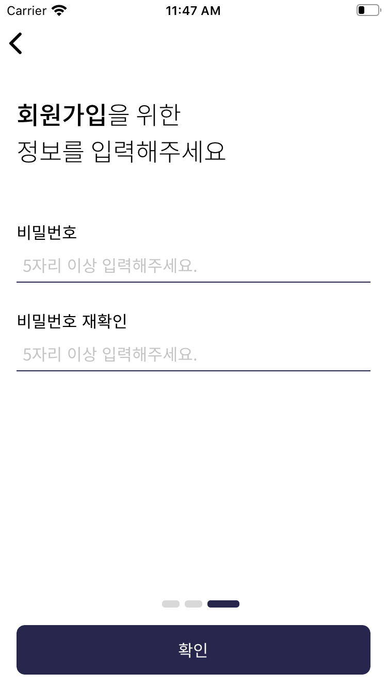
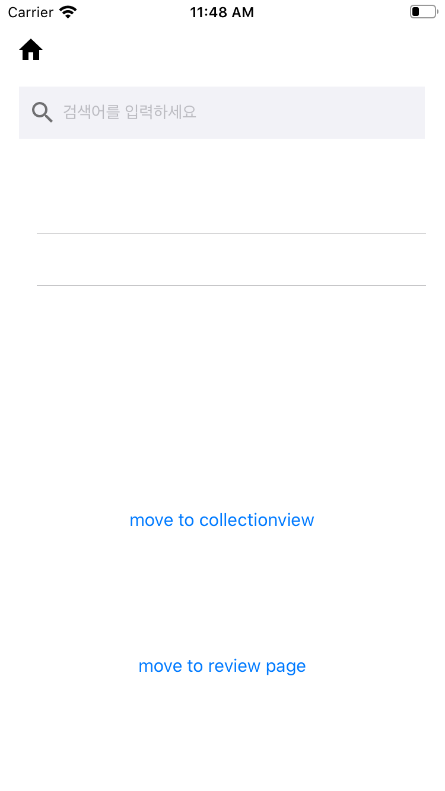
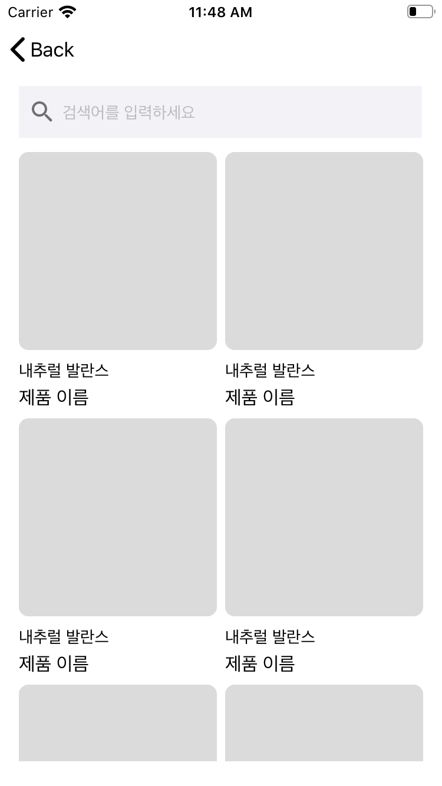
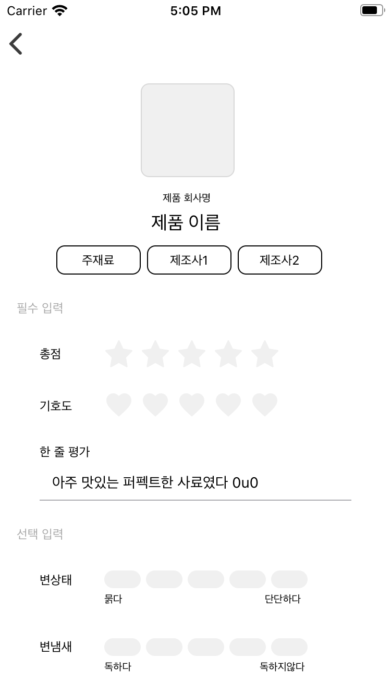
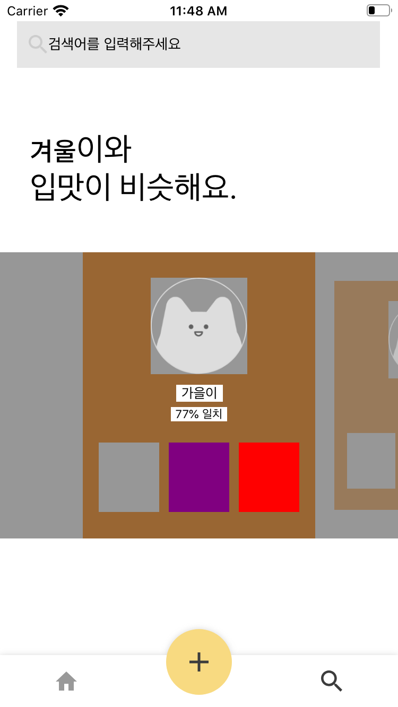

# 😸Ounce

## 

### We are Ounce‼️

> 고양이들은 입맛이 까다로워, 집사들은 성공확률이 높은 시도를 위해 먹여본 캣푸드를 따로 기록하고 있습니다.
> 저희는 이러한 집사들의 고민을 해결하기 위해 직관적인 기록, 서로의 목록 공유, 입맛이 비슷한 고양이 추천 기능을 제공하고 있습니다. 
>
> 기록부터 선택까지, 온스가 함께합니다.

## 🍎 목차

- [Coding-Convention](https://github.com/We-are-Ounce/Ounce_iOS/wiki/Ounce_Coding_Convention)

- [Foldering](https://github.com/We-are-Ounce/Ounce_iOS/wiki/Ounce_Foldering)

- [Scrum](https://github.com/We-are-Ounce/Ounce_iOS/wiki/Ounce_iOS_Scrum)

- [Work-flow](https://github.com/We-are-Ounce/Ounce_iOS/wiki/Ounce_Workflow)

- [Github manage](https://github.com/We-are-Ounce/OUNCE_iOS/wiki/Git-manage)

- [Library](#-library)

- [간단한 설명](#간단한-설명)

- [기능 소개](#-기능-소개)

- [Project](#-project)

- [팀원 소개](#-최강-아요-멤버)   

  

### 📱  개발 환경

* **Xcode 11.5**

* **iOS 13.0**

* **Swift 5**  

   

   

  

### 🛠 Library

| 라이브러리                                                   | 목적                             |
| ------------------------------------------------------------ | -------------------------------- |
| [Alamofire](https://github.com/Alamofire/Alamofire)          | 서버 통신                        |
| [Gedatsu](https://github.com/bannzai/Gedatsu)                | 오토레이아웃 에러 디버깅 검출    |
| [Kingfisher](https://github.com/onevcat/Kingfisher)          | 이미지 처리                      |
| [SnapKit](https://github.com/SnapKit/SnapKit)                | 코드 레이아웃 작성               |
| [SwiftKeychainWrapper](https://github.com/jrendel/SwiftKeychainWrapper) | 저장소 암호화를 위해서           |
| [Then](https://github.com/devxoul/Then)                      | 컴포넌트 코드 작성의 용이를 위해 |
| [YPImagePicker](https://github.com/Yummypets/YPImagePicker)  | 사진첩 사용                      |
| [UPCarouselFlowLayout](https://github.com/ink-spot/UPCarouselFlowLayout) | Carousel effect                  |
| [iOSDropDown](https://github.com/jriosdev/iOSDropDown)       | DropDown 효과                    |
| [CHIPageControl](https://github.com/ChiliLabs/CHIPageControl) | 인디케이터                       |

### 💻 기능 소개

| 기능        | 상세 기능                           | 담당                                    | 구현 여부 |
| ----------- | ----------------------------------- | --------------------------------------- | --------- |
| 스플래시    | 스플래시 (자동 로그인)              | [준현](https://github.com/5anniversary) | -         |
| 로그인      | 로그인                              | [준현](https://github.com/5anniversary) | -         |
| 회원가입    | 이메일 인증                         | [준현](https://github.com/5anniversary) | -         |
|             | 아이디 검증                         | [준현](https://github.com/5anniversary) | -         |
|             | 비밀번호 검증                       | [준현](https://github.com/5anniversary) | -         |
|             | 회원가입                            | [준현](https://github.com/5anniversary) | -         |
| 프로필 등록 | 프로필 등록                         | [준현](https://github.com/5anniversary) | -         |
| 홈 화면     | 정렬                                | [주연](https://github.com/juyeonblue)   | -         |
|             | 필터                                | [주연](https://github.com/juyeonblue)   | -         |
|             | 계정 선택                           | [주연](https://github.com/juyeonblue)   | -         |
|             | 계정 추가                           | [주연](https://github.com/juyeonblue)   | -         |
|             | 팔로워                              | [호세](https://github.com/psychehose)   | -         |
|             | 팔로잉                              | [호세](https://github.com/psychehose)   | -         |
|             | 설정                                | -                                       | -         |
|             | 프로필 수정                         | -                                       | -         |
| 설정        | 설정 메뉴 내부에서 프로필 삭제      | [주연](https://github.com/juyeonblue)   | -         |
| 기록하기    | 기록 하기                           | [윤진](https://github.com/profitjean)   | -         |
|             | 제품 검색                           | [윤진](https://github.com/profitjean)   | -         |
|             | 제품이 없을시 제품 생성과 함께 기록 | [윤진](https://github.com/profitjean)   | -         |
| 제품        | 제품 검색                           | [준현](https://github.com/5anniversary) | -         |
| 둘러보기    | 둘러보기 카드 뷰                    | [호세](https://github.com/psychehose)   | -         |
| 리뷰 추가   | 리뷰 추가                           | [준현](https://github.com/5anniversary) | -         |

### 📍 Screenshots

1. Splash

   

2. Login

   

3. Signup

   

   

   

4. Register

5. Home

   

6. Setting

7. Post

   

   

   

8. Browse  

   

   

   

### 📚 Project

- [Week 1](https://github.com/We-are-Ounce/OUNCE_iOS/projects/1)

- [Week 2](https://github.com/We-are-Ounce/OUNCE_iOS/projects/2)

- [Week 3](https://github.com/We-are-Ounce/OUNCE_iOS/projects/3)

- [Help/Bug](https://github.com/We-are-Ounce/OUNCE_iOS/projects/4)  

  

### 💡새롭게 알게 된 것 

> 김호세: carousel effect에 대해 알게되었슴당 및 autoLayout를 programmatically로 구현 방법을 알게되었슴당 히힛😝
>
> ~~~swift
> let labelName = UILabel().then {
>      $0.textColor = .black
>      $0.backgroundColor = .white
>      $0.textAlignment = .center
>      $0.font = UIFont.systemFont(ofSize: 13)
>      $0.text = "가을이"
>  } // Then을 이용해서, 라벨을 생성하고 가독성을 위해서 BrowseCvCell의 extension BrowseCVCell + constranint 을 만들었습니다. 그 후에
> 
> func initial() {  // Snapkit을 이용하여 programmatically autolayout을 설정 해주었습니다.
> contentView.addSubview(labelName) //contentView 안에 그려주고
> 
> labelName.snp.makeConstraints { (make) in
>          make.leading.equalTo(contentView.snp.leading).inset(88) // label의 leading을 contentView의 leading에 constraint를 걸었습니다.
>                                
>          make.trailing.equalTo(contentView.snp.trailing).inset(87) // label의 trailing을 contentView의 trailing에 constraint를 걸었습니다.
>                                
>          make.top.equalTo(imgCatView.snp.bottom).inset(-10) 
> // label의 top을 그 label 위에 있는 컴포넌트 (imgCatView)의 bottom에 걸었습니다. 기준이 bottom 이므로 Inset 값을 음수로 설정하였습니다.                        
>      }  
> }
> 
> ~~~
>

> 박주연: CollectionView보다 TableView가 더 좋다^^ 다 내꺼 호로록🥤

> 이윤진: NavigationController 연결 및 xib 활용 방법을 내가 정복했다🏋️‍♂️

> 오준현: custom TabBar 도전하기 빠샤🥊  
>
> 디자인파트에서 원하는 커스텀 탭바가 있어 새롭게 커스텀 탭바를 도전해봤습다~!
>
> 먼저 커스텀 탭바를 구현해줄 클래스가 필요해 만들어줍니다.
>
> ~~~swift
>     weak var addDelegate: RootTabBarDelegate?
>     
>     private lazy var addButton:UIButton = {
>         return UIButton()
>     }()
>     
>     override init(frame: CGRect) {
>         super.init(frame: frame)
>         UITabBar.clearShadow()
>         addButton.setBackgroundImage(UIImage.init(named: "btnAdd"), for: .normal)
>         addButton.addTarget(self,
>                             action: #selector(CustomTabBar.addButtonClick),
>                             for: .touchUpInside)
>         self.addSubview(addButton)
>     }
>     
>     required init?(coder aDecoder: NSCoder) {
>         fatalError("init(coder:) has not been implemented")
>     }
>     
>     @objc func addButtonClick(){
>         if addDelegate != nil{
>             addDelegate?.addClick()
>         }
>     }
>     
>     override func layoutSubviews() {
>         
>         super.layoutSubviews()
>         
>         let buttonX = self.frame.size.width/3
>         var index = 0
>         for barButton in self.subviews{
>             
>             if barButton.isKind(of: NSClassFromString("UITabBarButton")!){
>                 
>                 if index == 1{
>                     /// Setting the Add Button Position
>                     addButton.frame.size = CGSize.init(width: (addButton.currentBackgroundImage?.size.width)!, height: (addButton.currentBackgroundImage?.size.height)!)
>                     addButton.center = CGPoint.init(x: self.center.x, y: self.frame.size.height/2 - 18)
>                     index += 1
>                 }
>                 barButton.frame = CGRect.init(x: buttonX * CGFloat(index), y: 0, width: buttonX, height: self.frame.size.height)
>                 index += 1
>                 
>             }
>         }
>         self.bringSubviewToFront(addButton)
>     }
>     
>     /// Rewrite the hitTest method, listen for the button click to make the highlighted tabbar part respond to the click
>     override func hitTest(_ point: CGPoint, with event: UIEvent?) -> UIView? {
>         
>         /// Determine whether it is the root controller
>         if self.isHidden {
>             /// tabbar hiding is not handled in the home page system
>             return super.hitTest(point, with: event)
>             
>         }else{
>             /// Converting Money Touch Points to Buttons to Generate New Points
>             let onButton = self.convert(point, to: self.addButton)
>             /// Determine whether the new point is on the button
>             if self.addButton.point(inside: onButton, with: event){
>                 return addButton
>             }else{
>                 /// No System Processing on the Button
>                 return super.hitTest(point, with: event)
>             }
>         }
>     }
> 
> ~~~
>
> 여기서 주입해줄 Delegate 패턴을 만들어줍니다
>
> ~~~swift
> protocol RootTabBarDelegate:NSObjectProtocol {
>     func addClick()
> }
> ~~~
>
> 그리고 마지막으로 탭바 컨트롤러에서 Delegate를 주입받고
>
> ~~~swift
> extension TBC : RootTabBarDelegate{
>     
> }
> ~~~
>
> ~~~swift
>     override func viewDidLoad() {
>         super.viewDidLoad()
>         
>         let tab = CustomTabBar()
>         tab.addDelegate = self
>         self.setValue(tab, forKey: "tabBar")
>     }
> ~~~
>
> addClick 즉 커스텀 할때 가운데에 들어갈 버튼을 클릭할때 실행될 코드를 작성해주시면 됩니다,
>
> ~~~swift
>     func addClick() {
>         let sb = UIStoryboard(name: "Post", bundle: nil)
>         let vc = sb.instantiateViewController(withIdentifier: "PostNavVC") as! PostNavVC
>         vc.modalPresentationStyle = .fullScreen
>         
>         self.present(vc, animated: true)
>     }
> 
> ~~~
>
> 

### 😻 최강 아요 멤버

      

[김호세](https://github.com/psychehose )

> 성장

[박주연](https://github.com/juyeonblue)

> 앱스토어 출시 & 협업 능력 성장 

[이윤진](https://github.com/profitjean )

> iOS 실력 성장 & 앱스토어 출시

[오준현](https://github.com/soogoon)

> 앱스토어 출시

